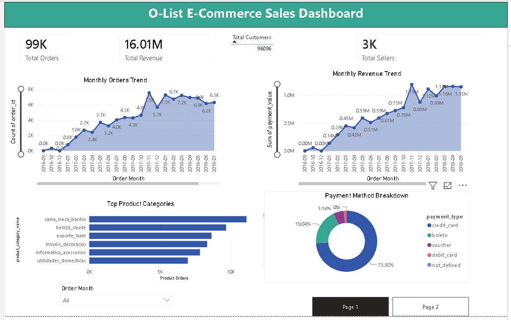

#  Olist E-Commerce Analytics Project

##  Project Overview
Complete analysis of Brazilian E-Commerce data
using SQL, Power BI and Python

##  Dashboard Preview

##  Tools Used
- Power BI Desktop — Interactive Dashboard
- MySQL Workbench — SQL Analysis
- VS Code — Code Editor
- Python — Data Cleaning & Analysis

##  Project Structure
##  Key Findings
- Total Orders: 99K
- Total Revenue: 16.01M BRL
- Total Customers: 96K
- Total Sellers: 3K
- Top Category: Bed Bath Table
- Most orders from: São Paulo (SP)
- Most popular payment: Credit Card (73.92%)

##  Dataset
Olist Brazilian E-Commerce Public Dataset from Kaggle

##  Key Files
-  Olist_Ecommerce_Dashboard.pdf — Full Dashboard
-  SQL queries (01-08) — Complete analysis